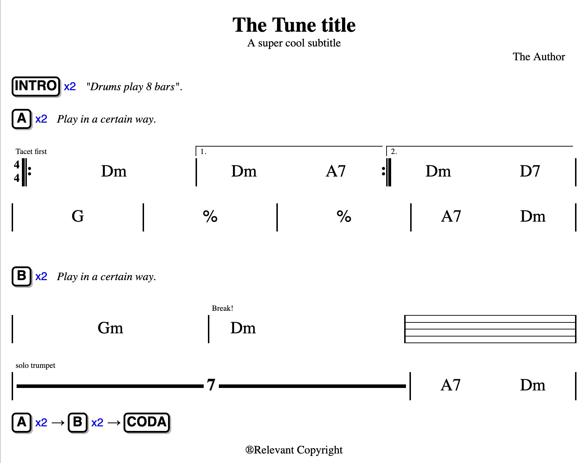

# Music Grid Markdown
Write formatted music grids (chords and structures), with live preview.

The output are well formatted music grids, that you can view or print. Here is an example:


The input is a text file written in a special *markdown* syntax called "music grid markdown". Here is the script that produced the grid above:

```
# The Tune title
## A super cool subtitle
Author: The Author // the composer's name
Copyright: Relevant Copyright

// this is a line comment

- [INTRO]x2 "Drums play 8 bars".

- [A]x2 Play in a certain way.

4/4 [: (Tacet first) Dm | (1.) Dm  A7 :](2.) Dm D7 |
| G | % | % | A7 Dm |

%vspace%

- [B]x2 Play in a certain way.

| Gm | (Break!) Dm - - - | === |
| (solo trumpet) -7- .l | A7 Dm |

- [A]x2 -> [B]x2 -> [CODA]
```

## Install and use

MusicMarkdown is an executable python module.

1. Download and install [Python3](https://www.python.org/downloads/) (if it is not installed already in your system)

2. Clone the project or download the file [release/musicmarkdown.zip](release/musicmarkdown.zip) and unzip it somewhere

3. Open a terminal window and go to the directory that contains `musicmarkdown`.

4. Install the module by running this command in a terminal window: `pip3 install ./musicmarkdown`

5. Create your music markdown script (or download [the example one](script.txt)).

6. In the terminal run this command:

		python3 -m musicmd script.txt

	this will generate an html file that you can open with your web browser. Then you can print it or save it as PDF etc.
	
	If you want to open a **live preview** that changes as you edit the script, you have two options:
	
	Maybe the easiest is to run this command in a terminal:
	
		python3 -m musicmd script.txt serve
	
	It will start a built-in web server and give you a link to open in a web browser. This will display the preview of the grid and show live modifications as you change (and save) your script. This option needs javascript enabled in your browser (which is usually the case, unless you disabled it on purpose)
	
	Another option is to use an external preview, for example [Atom](https://atom.io)'s "Preview HTML" extension. This allows to have the script and the preview in the same editor. In this case run this command in a terminal:

		python -m musicmd script.txt watch

	and then open both your script and the generated html file and start a preview.

## Music grid markdown syntax

### Title
Title and subtitle are specified with leading `#` as in standard markdown syntax.
* `Author:` and  `Copyright:` specify the corresponding field.

The title section is not compulsory.


### Comments
Comments start with `\\`
### Sections
sections are specified with a `-` at the beginning of the line.
Sections may contain:
* section names `[NAME]`
* repetitions `[NAME]x2`
* right arrows `->`
* normal text

### bars
Bars start with one of
* `|` normal
* `[` double open
* `]`double close
* A bar can be preceded by a tempo sign e.g. `3/4`
* A bar can be preceeded or followed by a repetition sign `:`

* modifiers `.l` (long) and `.s` (short) can be added in a bar to try to modify its size (works better for pauses and pentagrams).

Bars may contain a *case* text in brackets. values `1.` and `2.` are special and generate repetition cases.

### vertical space
Extra vertical space can be added with one of these:
* `%vspace%`
* `%vspace-big%`
* `%vspace-small%`


A bar may contain:
* `===` a pentagram
* `-4-` a pause
* `-` an empty space
* any other text will be interpreted as chord
* evry object in a bar must be separated by `whitespace`
